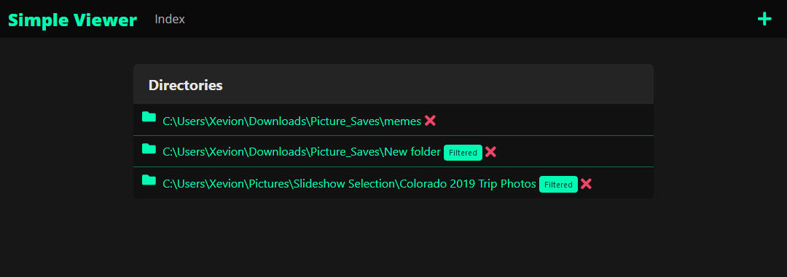
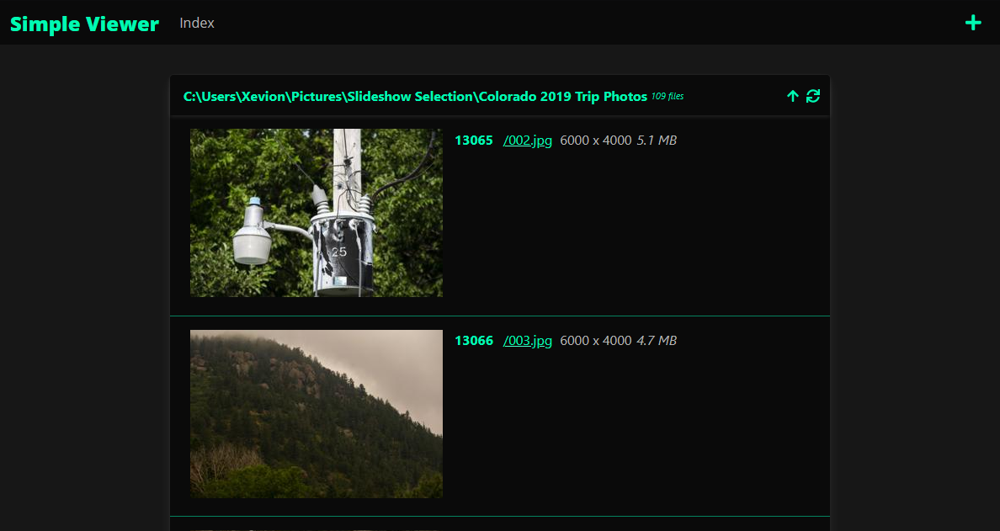
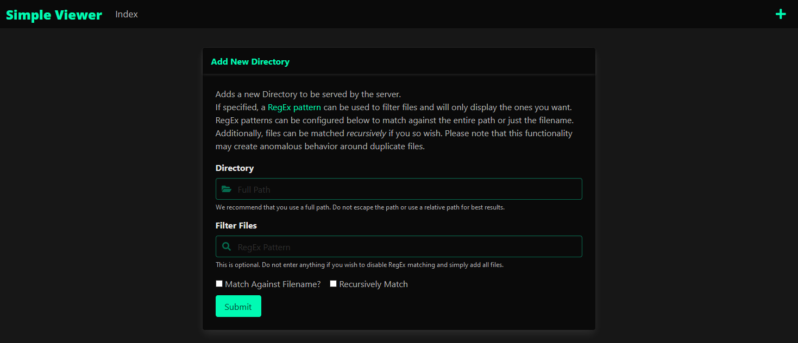

# simple-viewer

Simple Viewer is a small learning project designed to work as a static file server with accompanying viewing methods.

These viewing methods are intended to be as simple as possible, mostly focusing on video.

Planned are text files, source code files, PDFs, and pictures. Everything else will be served as direct browser links (the browser handles all viewing) or as downloads.

The project will be built in Django (as well as HTML/CSS/JS), my first ever project in the framework, so expect poorer standards, mishaps, some complex bugs (resolved with needlessly complex solutions) and such.

## Screenshots


<p align="center">Viewing the index, showing all available directories</p>


<p align="center">Browsing a directory with thumbnails and file information</p>


<p align="center">The Add Directory dialog</p>


## Setup

```
git clone https://github.com/Xevion/simple-viewer.git
pip install -r requirements.txt
```

Additionally, during development, you will want Sass files to be updated.

In a separate terminal, run this command to automatically generate .css files from .scss files when they are edited.

```
cd ./viewer/static/css/
sass --watch .
```

## Running `simple-viewer`

```
python manage.py runserver
```
